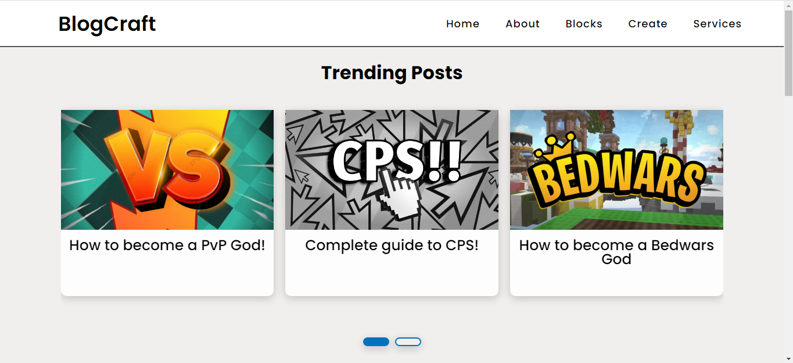

<h1 align="center">BlogCraft</h1>

 
<h2>A Blogging Website made on Minecraft </h2>

Made Using HTML, CSS, JavaScript,  contains some Blogs written as well with a well made carousel and sidebar with Media links.

<h2>An Overview of the Webisite</h2>
<li>Contains A Trending Posts Carousel./li>
<li>Contains a Recent posts Section.</li>
<li>A Separate Blog page for Individual Posts</li>
<li>A flexbox Sidebar for the Popular Posts Section.</li>
<li>Contains an About Section.</li>
<li>Contains a footer with built in contact form.</li>
